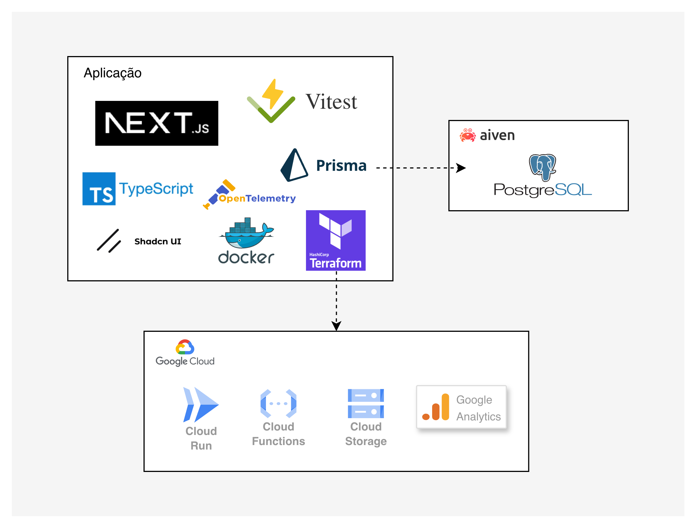
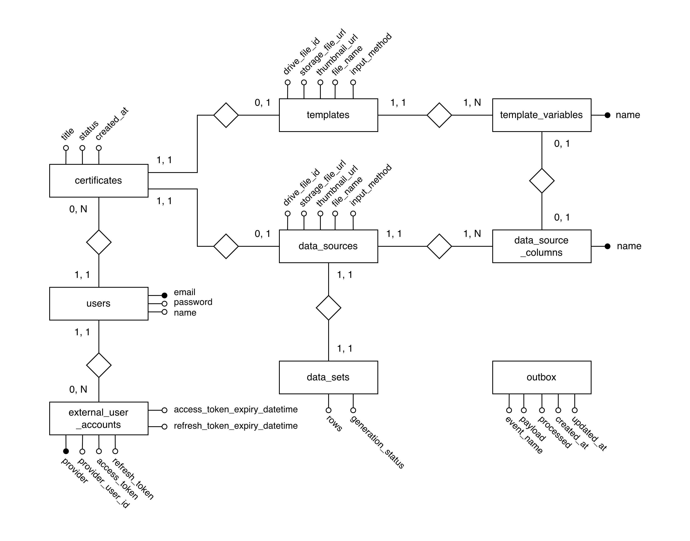

# Gerenciamento de Certificados

Aplicação web desenvolvida em Next.js com o objetivo de simplificar e automatizar o gerenciamento de certificados digitais. A plataforma oferece uma interface intuitiva que permite criar certificados personalizados, anexar templates e vincular diferentes fontes de dados de participantes.
O sistema é fortemente integrado aos serviços da Google, possibilitando o uso de arquivos do Google Drive, autenticação com OAuth 2.0, ferramentas da cloud, entre outros.
Dessa forma, a plataforma atende à necessidade de reduzir esforços manuais ou overhead de tentar automatizar esse processo por conta própria — o que é recorrente em instituições acadêmicas e organizacionais —, oferecendo um fluxo completo e intuitivo.

**Objetivo Acadêmico**: esse projeto será utilizado como Trabalho de Conclusão de Curso (TCC), além de utilizar tecnologias e conceitos de arquitetura na qual gostaria de me aperfeiçoar.

## Stack principal
- Next.js 15 + React 19 + TypeScript
- Prisma ORM
- PostgreSQL (banco padrão)
- Tailwind CSS
- Google Workspace (opcional, para login e upload no Drive)



## Como rodar (primeira vez)

### Pré‑requisitos
- Node.js 20+ e npm
- Docker e Docker Compose (recomendado para subir Postgres e Redis)
- Projeto no Google Cloud

### Passo a passo:

1. **Clone o repositório**:
    ```bash
    git clone https://github.com/Felyppe1/certificate-management.git
    cd certificate-management
    ```

2. **Instale as dependências**:
    ```bash
    npm install
    ```

3. **Configure as variáveis de ambiente**:

    Copie o arquivo `.env.example` para um arquivo `.env` na raiz do projeto

    ```bash
    cp .env.example .env
    ```

    Preencha as variáveis necessárias

4. **Criar containers**:
    
    Com o Docker rodando, crie e rode os containers necessários (PostgreSQL e Redis):

    ```bash
    docker compose up -d
    ```

5. **Instalar dependências do projeto**:

    ```bash
    npm install
    ```

6. **Execute as migrações do banco**:
    ```bash
    npx prisma generate
    npx prisma migrate dev
    ```

6. **Inicie o servidor**:
    ```bash
    npm run dev
    ```

    Acessível via: http://localhost:3000

## Como rodar nas próximas vezes
1. **Rodar containers**:
    
    Com o Docker rodando, rode os containers já criados:

    ```bash
    docker compose start
    ```

2. **Inicie o servidor de desenvolvimento**:
    ```bash
    npm run dev
    ```

    Acessível via: http://localhost:3000

## Modelagem do banco



### Padrão Outbox (eventos de domínio)

Esse projeto persiste eventos de domínio em uma tabela `outbox` junto com as alterações de dados de negócio, garantindo atomicidade.

Para trocar de banco de dados, é necessário implementar uma forma de persistir e capturar esses eventos para que o sistema funcione corretamente.


