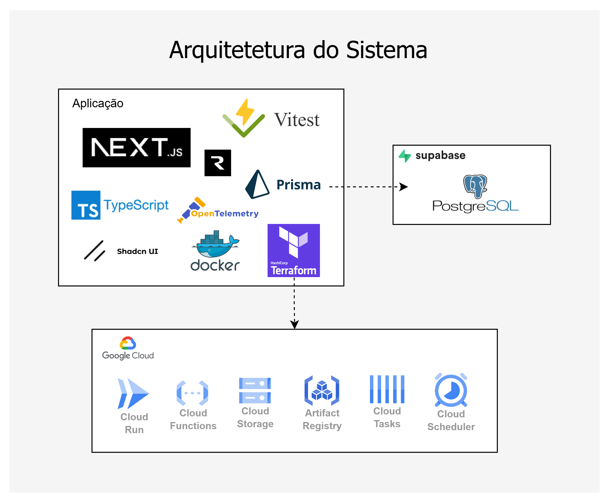
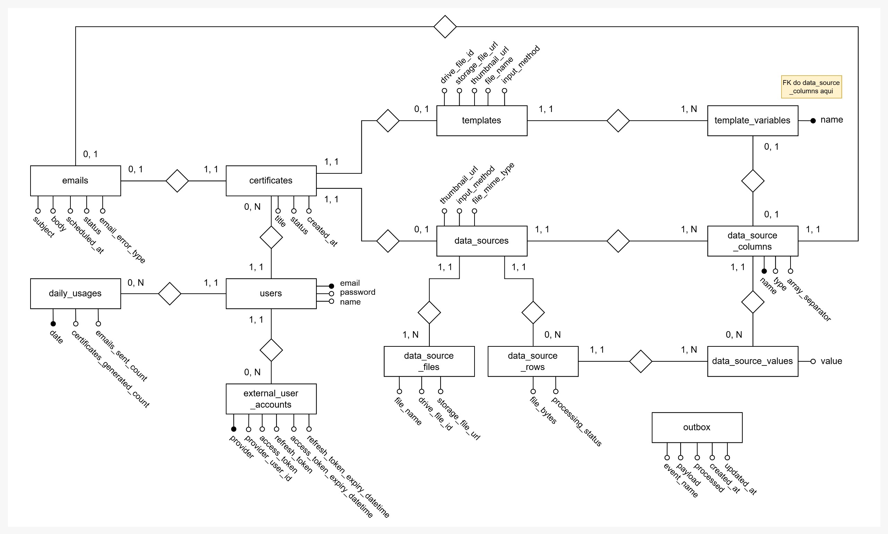
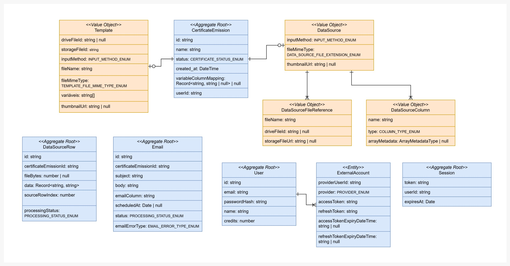

# Gerenciamento de Certificados

Essa aplicação web, desenvolvida com Next.js, foi criada para otimizar e automatizar a geração de certificados em massa. A plataforma combina uma interface intuitiva com um motor de personalização utilizando a sintaxe [Liquid](https://shopify.github.io/liquid/), permitindo a criação de templates dinâmicos. É possível importar planilhas ou utilizar IA para extração de dados via imagens. Além disso, você pode enviar os e-mails diretamente pela plataforma.

O sistema é fortemente integrado aos serviços da Google, possibilitando o uso de arquivos do Google Drive, autenticação com OAuth 2.0, ferramentas da cloud, entre outros.

Dessa forma, a plataforma atende à necessidade de reduzir esforços manuais ou overhead de tentar automatizar esse processo por conta própria — o que é recorrente em instituições acadêmicas e organizacionais —, oferecendo um fluxo completo e intuitivo.

**Objetivo Acadêmico**: esse projeto será utilizado como Trabalho de Conclusão de Curso (TCC), além de utilizar tecnologias e conceitos de arquitetura na qual gostaria de me aperfeiçoar.

## Stack principal

- Next.js 15 + React 19 + TypeScript
- Prisma ORM
- PostgreSQL (banco padrão)
- Tailwind CSS
- Google Workspace (opcional, para login e upload no Drive)



## Configurando o Google Cloud

Antes de rodar o sistema pela primeira vez, é necessário configurar alguns recursos no Google Cloud.

### 1. Configurar OAuth 2.0

1. **Crie um projeto** no [Google Cloud Console](https://console.cloud.google.com/).
2. **Crie um Branding** em _APIs e Serviços → Tela de permissão OAuth_.
3. **Crie um cliente OAuth**:
    - Vá em _APIs e Serviços → Clientes → Criar cliente_.
    - Selecione Aplicativo da Web.
    - Adicione `http://localhost:3000` em Origens JavasScript autorizadas.
    - Adicione `http://localhost:3000/api/auth/google/callback` em URIs de redirecionamento autorizados.
    - Anote o `client_id` e o `client_secret` gerados — você vai precisar deles nas variáveis de ambiente.
4. **Adicione os escopos** necessários em _APIs e Serviços -> Acesso a dados_:
    - `https://www.googleapis.com/auth/drive.file` (Escopos não confidenciais)
    - `https://www.googleapis.com/auth/drive.readonly` (Escopos restritos)
5. **Adicione os usuários permitidos** em _APIs e Serviços -> Público-alvo_ (enquanto o app estiver em modo de teste).

### 2. Criar o bucket de certificados

É necessário um bucket no Google Cloud Storage para armazenar os certificados gerados. Você pode criá-lo manualmente no [Console do GCP](https://console.cloud.google.com/storage) ou provisionar via Terraform (veja a pasta `terraform/`).

### 3. Autenticar com gcloud

1. **Instale o gcloud CLI**: https://cloud.google.com/sdk/docs/install-sdk?hl=pt-br#deb

2. **Autentique-se impersonando a Service Account**:

    ```bash
    gcloud auth application-default login --impersonate-service-account=<email-da-service-account>
    ```

---

## Como rodar o sistema (primeira vez)

### Pré‑requisitos

- Node.js 20+ e npm
- Docker e Docker Compose (recomendado para subir Postgres e Redis)
- Projeto no Google Cloud configurado (veja a seção acima)
- gcloud CLI instalado e autenticado

### Passo a passo:

1. **Configure as variáveis de ambiente**:

    Copie o arquivo `.env.example` para um arquivo `.env` na raiz do projeto

    ```bash
    cp .env.example .env
    ```

    Preencha as variáveis necessárias

2. **Criar containers**:

    Com o Docker rodando, crie e rode os containers necessários:

    ```bash
    docker compose up -d
    ```

3. **Instale as dependências**:

    ```bash
    npm install
    ```

4. **Crie o client do Prisma ORM e execute as migrações do banco**:

    ```bash
    npm run prisma:generate
    npm run prisma:dev
    ```

5. **Inicie o servidor**:

    ```bash
    npm run dev
    ```

    Acessível via: http://localhost:3000

### Como rodar o sistema nas próximas vezes

1. **Rodar containers**:

    Com o Docker rodando, rode os containers já criados:

    ```bash
    docker compose start
    ```

2. **Inicie o servidor de desenvolvimento**:

    ```bash
    npm run dev
    ```

    Acessível via: http://localhost:3000

## Modelagem

### Banco de dados

A modelagem está normalizada até a **3FN**. Cada atributo armazena apenas dados atômicos e depende exclusivamente da chave primária de sua tabela, o que minimiza o custo de armazenamento e simplifica a lógica da aplicação.



### Modelagem do domínio



